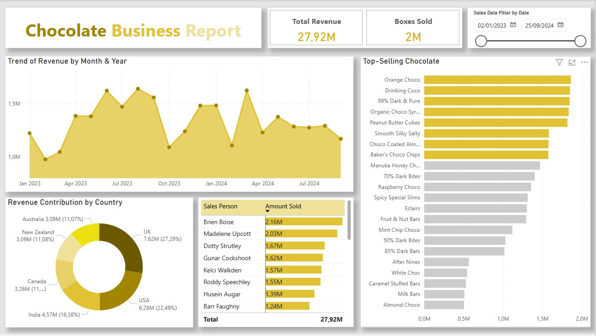

# 📊 Chocolate Business Report – Power BI Dashboard Overview
This Power BI dashboard presents a comprehensive analysis of chocolate sales performance across various dimensions including time, geography, products, and personnel. Below is a breakdown of the key visual components:
# This repository contain 

Dataset

Power Bi dashboard (Data analysis & visualisation)

Power Point presentation (insights)

Word document(insight description in details) 

Image of the power bi dashboard

# 1. Trend of Revenue by Month & Year (Line Chart)
Type: Area + Line Chart

Description: Displays monthly revenue performance from January 2023 to September 2024.

# Insights:

Reveals seasonal patterns and revenue fluctuations.

Shows peak sales in June 2023, August 2023, and March 2024.

Useful for identifying high-performing months and possible seasonality.

# 2. Total Revenue & Boxes Sold (KPI Cards)
Type: KPI Cards

# Metrics:

Total Revenue: 27.92M

Boxes Sold: 2M

Purpose: Gives a quick snapshot of overall performance over the selected date range.

# 3. Sales Date Filter by Date (Slicer)
Type: Date Range Slicer

Description: Enables users to dynamically filter all visuals based on custom date ranges.

Current Range: 02/01/2023 to 25/09/2024

# 4. Top-Selling Chocolate (Horizontal Bar Chart)
Type: Bar Chart (Ranked)

Description: Ranks chocolate products based on sales volume.

Top Performers:

Orange Choco

Drinking Coco

99% Dark & Pure

Organic Choco Syrup

Peanut Butter Cubes

Purpose: Highlights customer preferences and product performance.

# 5. Revenue Contribution by Country (Donut Chart)
Type: Donut / Pie Chart

Description: Shows percentage revenue contribution by country.

Top Contributors:

UK (27.29%)

USA (22.49%)

India (16.38%)

Use Case: Useful for regional targeting and market expansion decisions.

# 6. Sales Person Performance (Bar Chart)
Type: Horizontal Bar Chart

Description: Compares revenue generated by individual sales representatives.

Top Sellers:

Brien Boise (2.16M)

Madelene Upcott (2.03M)

Dotty Strutley (1.67M)

Purpose: Identifies top performers for recognition or training opportunities.

# 💾 Dataset Source (for GitHub)
You can mention this in your GitHub repository under the data/ or docs/ folder if available:

# Dataset Contents:

Monthly sales data

Product-level details

Country and region-wise revenue

Salesperson performance

Order quantity and price

# Analysis Focus:

Time-series analysis

Product sales ranking

Country-wise contribution

Employee performance

# 🧠 Tools Used
Power BI Desktop for visualization and dashboard creation

DAX and Power Query for data transformation and calculated metrics
